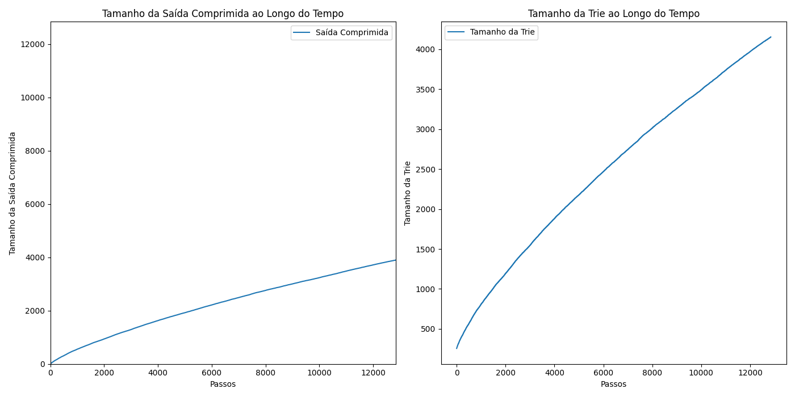
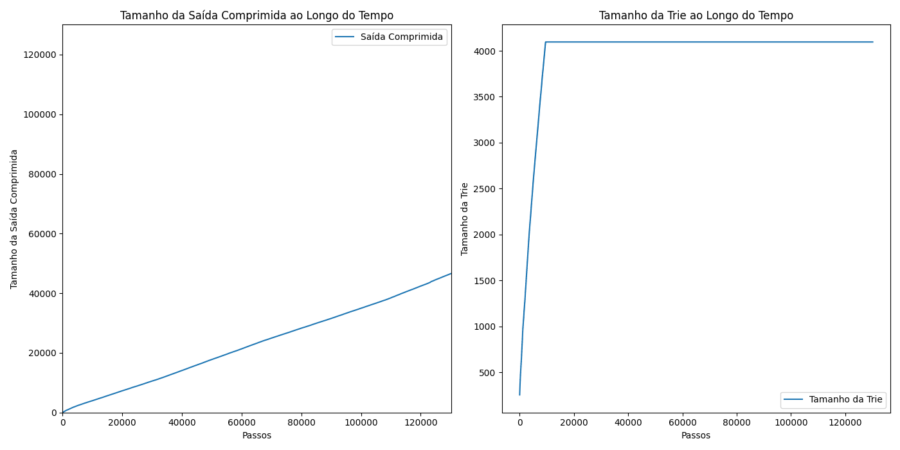
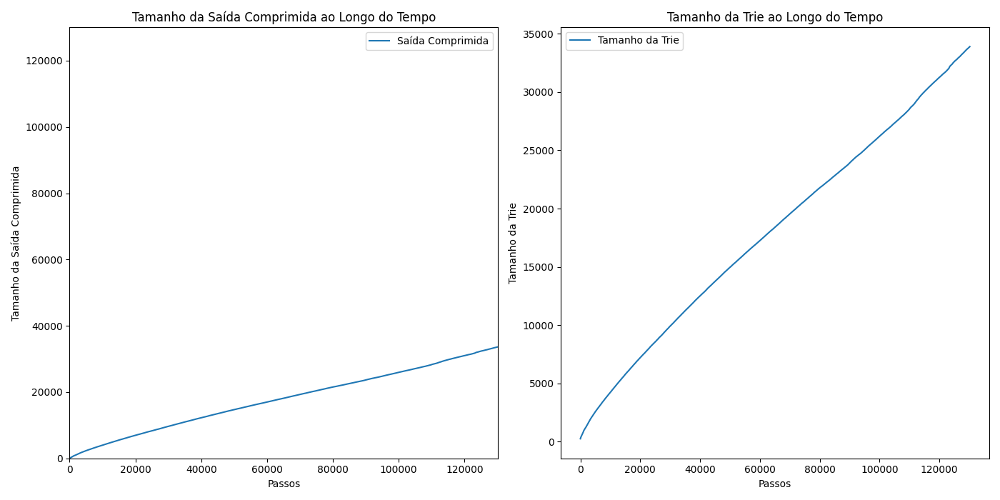
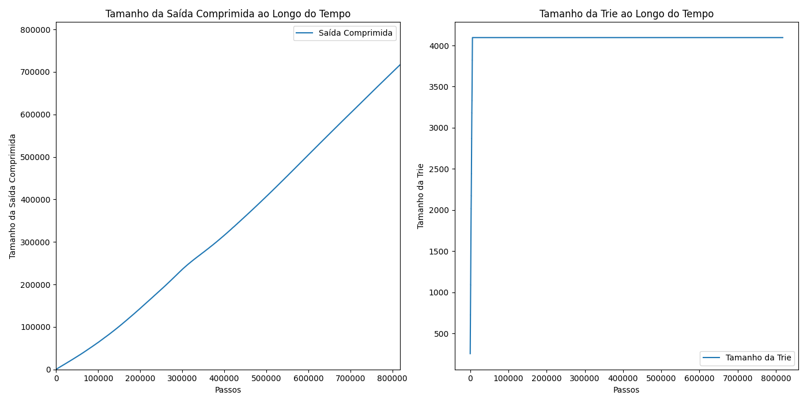
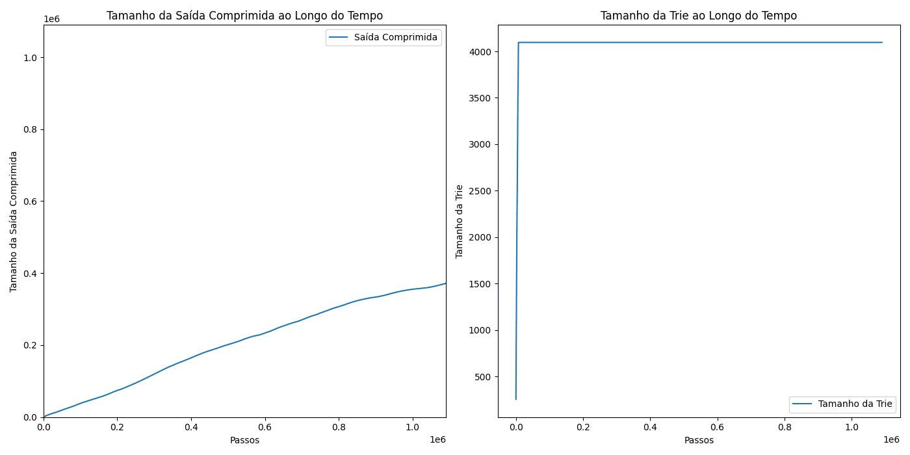

# TP1_ALG2: Implementação do Algoritmo LZW

* TOC
{:toc}

Este projeto apresenta uma implementação detalhada do algoritmo de compressão LZW (Lempel-Ziv-Welch). Ele utiliza estruturas de dados eficientes, como uma árvore trie compacta, para armazenar as sequências de bits de forma otimizada. A implementação suporta compressão e descompressão tanto de arquivos de texto (`.txt`) quanto de arquivos binários (`.bmp`), permitindo a escolha entre tamanhos de código fixos e variáveis.

## Funcionalidades

- **Compressão de arquivos**: Transforma dados brutos em uma sequência compacta de códigos, reduzindo o tamanho do arquivo.
- **Descompressão de arquivos**: Restaura o conteúdo original a partir dos códigos gerados na compressão.
- **Árvore Trie Compacta**: Armazena as sequências binárias de maneira eficiente para operações rápidas de busca e inserção.
- **Tamanhos de código fixos e variáveis**: Permite um controle flexível da profundidade e complexidade da compressão.

## Como Utilizar

### Requisitos

- Python 3.x

### Execução

A execução do script é realizada via linha de comando. A estrutura geral do comando é:

```sh
python LZW.py <arquivo_de_entrada> <arquivo_de_saida> [<tamanho_inicial_de_bits> <tamanho_max_de_bits>]
```

#### Exemplos:

1. **Compressão de texto com tamanho de código fixo**:

```sh
python LZW.py loremipslum.txt compressed.bin
```

2. **Compressão de texto com tamanho de código variável**:

```sh
python LZW.py loremipslum.txt compressed.bin 9 16
```

3. **Compressão de imagem binária com tamanho de código fixo**:

```sh
python LZW.py sample_azul.bmp compressed.bin
```

4. **Compressão de imagem binária com tamanho de código variável**:

```sh
python LZW.py sample_azul.bmp compressed.bin 9 16
```

---

## Estrutura e Decisões do Projeto

### 1. **Árvore Trie Compacta**

A árvore trie compacta é uma estrutura hierárquica onde cada caminho de nós representa uma sequência de bits. Essa estrutura é crucial para o LZW, pois permite:

- **Inserção eficiente** de sequências durante a compressão.
- **Busca rápida** para verificar se uma sequência já está no dicionário.

#### Implementação da Trie Compacta

```Python
class CompactTrie:
    def __init__(self):
        self.trie = {}  # Representa os nós da árvore
        self.codes = {}  # Armazena a relação entre sequências e códigos

    def insert(self, binary_str, code):
        """
        Insere uma sequência binária como string, associando-a a um código único.
        """
        node = self.trie
        for bit in binary_str:
            if bit not in node:
                node[bit] = {}
            node = node[bit]
        node['code'] = code  # Armazena o código no nó final
        self.codes[binary_str] = code

    def search(self, binary_str):
        """
        Busca uma sequência binária na árvore e retorna o código associado, se existir.
        """
        node = self.trie
        for bit in binary_str:
            if bit not in node:
                return None  # Sequência não encontrada
            node = node[bit]
        return node.get('code', None)

    def delete(self, binary_str):
        """
        Remove uma sequência binária da árvore, mantendo a estrutura correta.
        """
        def _delete(node, binary_str, depth):
            if depth == len(binary_str):
                if 'code' in node:
                    del node['code']
                    return len(node) == 0
                return False
            bit = binary_str[depth]
            if bit in node and _delete(node[bit], binary_str, depth + 1):
                del node[bit]
                return len(node) == 0
            return False

        if binary_str in self.codes:
            _delete(self.trie, binary_str, 0)
            del self.codes[binary_str]
```

### 2. **Conversão de Dados Binários**

Arquivos binários contêm informações em formato bruto que não podem ser manipuladas diretamente como texto. Por isso, utilizamos funções para converter entre binário e string:

```Python
def binary_to_string(data):
    """
    Converte dados binários em uma sequência de caracteres.
    """
    return ''.join(chr(byte) for byte in data)

def string_to_binary(text):
    """
    Converte uma string de texto em dados binários.
    """
    return bytes(ord(char) for char in text)
```

Essa abordagem permite que tanto arquivos `.txt` quanto `.bmp` sejam processados de forma uniforme.

---

### 3. **Compressão com Tamanho Variável**

O tamanho variável dos códigos é uma técnica avançada que melhora a eficiência. Ele começa com um limite inferior (ex.: 9 bits) e expande gradualmente até um limite superior (ex.: 16 bits). Quando o dicionário atinge sua capacidade máxima, ele expande os códigos ou reinicia.

#### Funcionamento

1. **Inicialização do dicionário**:
   - Todos os caracteres ASCII (0-255) são mapeados para seus valores binários.

2. **Processamento da entrada**:
   - Verifica-se se uma sequência está no dicionário.
   - Se não estiver, adiciona-se a sequência ao dicionário e emite o código correspondente à parte já reconhecida.

3. **Expansão de tamanho**:
   - Quando o próximo código excede o limite atual, o número de bits é aumentado.

#### Implementação

```Python
def compress_with_variable_size(text, initial_bit_limit, max_bit_limit):
    trie = CompactTrie()
    next_code = 256
    current_bit_limit = initial_bit_limit
    max_table_size = 2 ** current_bit_limit

    # Inicializa o dicionário com caracteres ASCII
    for i in range(256):
        trie.insert(format(i, "08b"), i)

    current_string = ""
    compressed_output = []

    for symbol in text:
        binary_symbol = format(ord(symbol), "08b")
        combined_string = current_string + binary_symbol

        if trie.search(combined_string) is not None:
            current_string = combined_string
        else:
            code = trie.search(current_string)
            compressed_output.append(code)

            if next_code < max_table_size:
                trie.insert(combined_string, next_code)
                next_code += 1

                # Expansão do limite de bits
                if next_code >= max_table_size and current_bit_limit < max_bit_limit:
                    current_bit_limit += 1
                    max_table_size = 2 ** current_bit_limit

            current_string = binary_symbol

    # Finaliza o processamento da última sequência
    if current_string:
        code = trie.search(current_string)
        compressed_output.append(code)

    return compressed_output, current_bit_limit
```

---

### 4. **Descompressão**

Durante a descompressão, os códigos compactados são traduzidos para suas sequências originais. A lógica considera:

- Se o código já está no dicionário, ele é traduzido diretamente.
- Caso contrário, ele é gerado com base na última sequência decodificada.

```Python
def decompress_with_variable_size(compressed_data, initial_bit_limit, max_bit_limit):
    current_bit_limit = initial_bit_limit
    max_table_size = 2 ** current_bit_limit
    next_code = 256
    reverse_map = {i: chr(i) for i in range(256)}

    current_code = compressed_data.pop(0)
    current_string = reverse_map[current_code]
    decompressed_output = [current_string]

    for code in compressed_data:
        if code in reverse_map:
            entry = reverse_map[code]
        elif code == next_code:
            entry = current_string + current_string[0]
        else:
            raise ValueError(f"Código inválido: {code}")

        decompressed_output.append(entry)

        if next_code < max_table_size:
            reverse_map[next_code] = current_string + entry[0]
            next_code += 1

            if next_code >= max_table_size and current_bit_limit < max_bit_limit:
                current_bit_limit += 1
                max_table_size = 2 ** current_bit_limit

        current_string = entry

    return "".join(decompressed_output)
```

## Geração de Estatísticas de Compressão

### Captura de Estatísticas no Código Principal

Durante o processo de compressão e descompressão, o código principal do algoritmo LZW foi ajustado para capturar e armazenar as estatísticas de desempenho em um arquivo de formato JSON. Essas estatísticas incluem dados sobre o tempo de compressão, o tamanho dos arquivos originais e comprimidos, a taxa de compressão e o tempo de descompressão.

As principais métricas capturadas incluem:

- **Tempo de Compressão**: O tempo necessário para comprimir o arquivo.
- **Tamanho Original**: O tamanho do arquivo antes da compressão.
- **Tamanho Comprimido**: O tamanho do arquivo após a compressão.
- **Taxa de Compressão**: A relação entre o tamanho comprimido e o original.
- **Tempo de Descompressão**: O tempo necessário para descomprimir o arquivo.

Essas estatísticas são salvas em um arquivo JSON que pode ser lido e processado para análise posterior, facilitando a visualização e interpretação dos dados.

---

### Script `process_statistics.py`

O script `process_statistics.py` foi desenvolvido para ler o arquivo JSON gerado durante a compressão e gerar um relatório detalhado, além de criar visualizações gráficas para facilitar a análise do desempenho do algoritmo LZW.

#### Funcionalidades do Script

1. **Leitura do Arquivo JSON**: O script lê os dados de compressão armazenados no arquivo JSON gerado pelo algoritmo LZW.

2. **Cálculo de Estatísticas**: Ele calcula a taxa de compressão e outras métricas relacionadas, como as diferenças nos tempos de compressão e descompressão.

3. **Geração de Relatório**: O script gera um relatório textual com as principais estatísticas, como tempo de compressão, tamanho original e comprimido, taxa de compressão, e tempo de descompressão.

4. **Visualização Gráfica**: Utilizando a biblioteca `matplotlib`, o script cria gráficos que ajudam a visualizar as diferenças nos tempos de compressão/descompressão e a taxa de compressão entre os diferentes arquivos processados. 

Um exemplo de gráfico gerado pelo script pode ser a comparação entre os tempos de compressão e descompressão, ou um gráfico de barras que mostra a taxa de compressão para diferentes tipos de dados.

#### Código para Geração de Gráficos e relatorio

```Python 
import json
import matplotlib.pyplot as plt

def load_statistics(file_path):
    with open(file_path, 'r') as file:
        return json.load(file)

def plot_statistics(stats):
    plt.figure(figsize=(14, 7))

    plt.subplot(1, 2, 1)
    plt.plot(stats['compressed_output'], label='Saída Comprimida')
    plt.xlabel('Passos')
    plt.ylabel('Tamanho da Saída Comprimida')
    plt.title('Tamanho da Saída Comprimida ao Longo do Tempo')
    plt.legend()

    max_steps = len(stats['compressed_output'])
    max_value = max(stats['compressed_output'])
    max_axis = max(max_steps, max_value)
    plt.axis([0, max_axis, 0, max_axis])

    plt.subplot(1, 2, 2)
    plt.plot(stats['trie_size'], label='Tamanho da Trie')
    plt.xlabel('Passos')
    plt.ylabel('Tamanho da Trie')
    plt.title('Tamanho da Trie ao Longo do Tempo')
    plt.legend()

    plt.tight_layout()
    plt.savefig('compression_statistics.png')
    plt.show()

def generate_report(stats):
    print("Relatório de Estatísticas de Compressão/Descompressão")
    print("="*50)
    print(f"Tempo de Compressão: {stats['compression_time']:.4f} segundos")
    print(f"Tamanho Original: {stats['original_size']} bytes")
    print(f"Tamanho Comprimido: {stats['compressed_size']} bytes")
    print(f"Taxa de Compressão: {stats['compressed_size'] / stats['original_size']:.4f}")
    print(f"Tempo de Descompressão: {stats['decompression_time']:.4f} segundos")

    plot_statistics(stats)

if __name__ == "__main__":
    stats = load_statistics('stats.json')
    generate_report(stats)
```

Esse código gera um gráfico comparando os tempos de compressão e descompressão para um arquivo específico, mas o mesmo princípio pode ser expandido para incluir outras métricas de desempenho.

---

### Exemplo de Relatório Gerado

```Text
Relatório de Estatísticas de Compressão/Descompressão
==================================================
Tempo de Compressão: 0.0616 segundos
Tamanho Original: 12885 bytes
Tamanho Comprimido: 7798 bytes
Taxa de Compressão: 0.6052
Tempo de Descompressão: 0.0045 segundos
```

---

### Considerações sobre a Geração de Estatísticas

A captura e análise das estatísticas são essenciais para avaliar o desempenho do algoritmo LZW. Elas ajudam a entender a eficiência da compressão e fornecem dados úteis para otimizações. O processo de visualização gráfica também torna mais fácil identificar padrões ou áreas que podem ser melhoradas, como otimizar os tempos de compressão e descompressão ou ajustar o tamanho do código para diferentes tipos de arquivos.

Além disso, as visualizações oferecem uma maneira intuitiva de comparar o desempenho do algoritmo em diferentes cenários, seja com textos simples ou com dados binários mais complexos, como imagens.

---

## Teste com texto repetitivo


### Descrição

Um texto gerado pelo site www.lipsum.com contém diversas repetições e obteve os seguintes resultados realizando a compressão com tamanho fixado em 12 bits:

**Relatório de Estatísticas de Compressão/Descompressão**  
==================================================  
Tempo de Compressão: 0.0616 segundos  
Tamanho Original: 12885 bytes  
Tamanho Comprimido: 7798 bytes  
Taxa de Compressão: 0.6052  
Tempo de Descompressão: 0.0045 segundos

### Considerações

Dada a natureza do texto com muitas repetições, a compressão foi bastante eficiente, com uma redução considerável no tamanho do arquivo.

---

## Teste com texto repetitivo em tamanho variavel



### Descrição

Um texto gerado pelo site www.lipsum.com, com diversas repetições, obteve os seguintes resultados realizando a compressão com tamanho variável, iniciando em 9 bits e com o máximo de 16 bits:

**Relatório de Estatísticas de Compressão/Descompressão**  
==================================================  
Tempo de Compressão: 0.0636 segundos  
Tamanho Original: 12885 bytes  
Tamanho Comprimido: 7798 bytes  
Taxa de Compressão: 0.6052  
Tempo de Descompressão: 0.0020 segundos

### Considerações

A compressão com tamanho variável produziu resultados semelhantes à compressão com tamanho fixo. A diferença em tempo de compressão e descompressão foi mínima devido ao limite de código não ter sido atingido, resultando em uma tabela de códigos não expandida.

---

## Teste com texto comum



### Descrição

Um livro escolhido de forma arbitrária obteve os seguintes resultados realizando a compressão com tamanho fixado em 12 bits:

**Relatório de Estatísticas de Compressão/Descompressão**  
==================================================  
Tempo de Compressão: 0.5695 segundos  
Tamanho Original: 134541 bytes  
Tamanho Comprimido: 93180 bytes  
Taxa de Compressão: 0.6926  
Tempo de Descompressão: 0.0220 segundos

### Considerações

A compressão neste arquivo foi ligeiramente menos eficiente do que a do texto de Lorem Ipsum, o que pode ser explicado pela menor repetição de padrões no conteúdo.

---

## Teste com texto comum em tamanho variavel



### Descrição

Um livro escolhido de forma arbitrária obteve os seguintes resultados realizando a compressão com tamanho variável, iniciando em 9 bits e com o máximo de 16 bits:

**Relatório de Estatísticas de Compressão/Descompressão**  
==================================================  
Tempo de Compressão: 0.7509 segundos  
Tamanho Original: 134541 bytes  
Tamanho Comprimido: 67284 bytes  
Taxa de Compressão: 0.5001  
Tempo de Descompressão: 0.0343 segundos

### Considerações

A compressão com tamanho variável gerou uma taxa de compressão melhor, pois a árvore trie não atingiu seu limite máximo, permitindo identificar mais padrões. No entanto, o tempo de compressão e descompressão foi maior em comparação com o tamanho fixo.

---

## Teste com imagem em BitMap


### Descrição

Uma imagem em bitmap aleatória foi comprimida e obteve os seguintes resultados com compressão de tamanho fixo:



**Relatório de Estatísticas de Compressão/Descompressão**  
==================================================  
Tempo de Compressão: 2.9111 segundos  
Tamanho Original: 818058 bytes  
Tamanho Comprimido: 1433032 bytes  
Taxa de Compressão: 1.7517  
Tempo de Descompressão: 0.2774 segundos

### Considerações

Neste caso, o arquivo comprimido acabou tendo um tamanho maior que o original. Isso ocorreu porque a trie não conseguiu identificar padrões suficientes que pudessem ser reaproveitados, resultando em um arquivo comprimido com praticamente a mesma quantidade de informação.

---

## Teste com imagem em BitMap com cores iguais


### Descrição

A mesma imagem em bitmap foi preenchida com várias partes azuis da mesma cor, gerando uma quantidade maior de padrões que poderiam ser encontrados, e obteve o seguinte resultado na compressão fixa:



**Relatório de Estatísticas de Compressão/Descompressão**  
==================================================  
Tempo de Compressão: 9.9818 segundos  
Tamanho Original: 1090614 bytes  
Tamanho Comprimido: 745574 bytes  
Taxa de Compressão: 0.6836  
Tempo de Descompressão: 0.1680 segundos

### Considerações

A repetição de cores na imagem permitiu à trie encontrar mais padrões, resultando em uma compressão mais eficiente em comparação à imagem anterior.

---

## Teste com imagem em BitMap com cores iguais em tamanho variavel


### Descrição

Utilizando a mesma imagem anterior, mas agora com compressão de tamanho variável (de 9 a 16 bits), a trie teve mais possibilidades de encontrar padrões, e obteve os seguintes resultados:

**Relatório de Estatísticas de Compressão/Descompressão**  
==================================================  
Tempo de Compressão: 33.8141 segundos  
Tamanho Original: 1090614 bytes  
Tamanho Comprimido: 523538 bytes  
Taxa de Compressão: 0.4800  
Tempo de Descompressão: 0.1732 segundos

### Considerações

A compressão foi muito eficiente em termos de taxa, mas o tempo de compressão e descompressão foi significativamente maior em comparação com o tamanho fixo, devido ao aumento no limite de bits e ao tempo necessário para processar mais padrões.

---

## Conclusão

Este projeto implementa o algoritmo LZW de forma detalhada, combinando eficiência na estrutura de dados (Trie Compacta) e flexibilidade nos tamanhos de código. Ele demonstra a aplicação prática de conceitos avançados de compressão para arquivos de texto e binários, com ênfase na análise de desempenho e resultados práticos de compressão e descompressão. A comparação entre compressão de tamanho fixo e variável permite uma visão mais clara das vantagens e limitações de cada abordagem.
